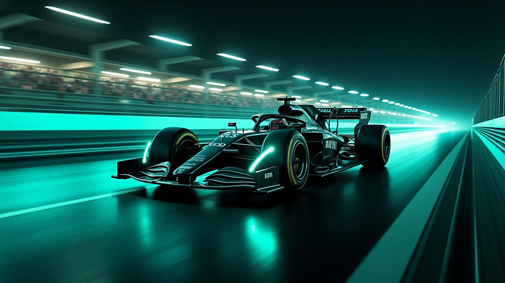

## RAVEN GP — The Official Race Week Experience

<p align="center">
  
</p>

**Lights out and away we go.** 

Welcome to **RAVEN GP** — the official digital paddock for our Bosch Future Mobility Challenge entry. This isn't just a website; it's a high-performance telemetry interface designed to bring the adrenaline of the track to your screen.

Built with the precision of a Formula 1 team, RAVEN GP combines cinematic visuals, race-day atmosphere, and cutting-edge web technology to deliver the ultimate reveal.

## Grid Preview

<div style="display:flex;gap:16px;flex-wrap:wrap;margin:24px 0;">
  
  <div style="flex:1;min-width:260px;background:#fff;border-radius:10px;padding:18px;box-shadow:0 6px 18px rgba(0,0,0,0.06);">
    <h3 style="margin:0 0 8px 0; font-size: 1.25rem;">🏎️ Race Day Atmosphere</h3>
    <p style="margin:0;color:#4b5563;font-size:14px;line-height:1.5;">
      Feel the tension build with our custom <strong>Starting Lights Sequence</strong> and immersive, high-octane video backgrounds. It's not just a landing page; it's the warm-up lap.
    </p>
  </div>

  <div style="flex:1;min-width:260px;background:#fff;border-radius:10px;padding:18px;box-shadow:0 6px 18px rgba(0,0,0,0.06);">
    <h3 style="margin:0 0 8px 0; font-size: 1.25rem;">🌍 World Championship (i18n)</h3>
    <p style="margin:0;color:#4b5563;font-size:14px;line-height:1.5;">
      Competing on the global stage. Seamless, route-based localization for <strong>English</strong>, <strong>Romanian</strong>, and <strong>Arabic</strong> means we speak the language of speed, everywhere.
    </p>
  </div>

  <div style="flex:1;min-width:260px;background:#fff;border-radius:10px;padding:18px;box-shadow:0 6px 18px rgba(0,0,0,0.06);">
    <h3 style="margin:0 0 8px 0; font-size: 1.25rem;">⚡ Engineering Excellence</h3>
    <p style="margin:0;color:#4b5563;font-size:14px;line-height:1.5;">
      Under the hood: a turbocharged <strong>Vite</strong> engine, <strong>React</strong> chassis, and <strong>Tailwind</strong> aerodynamics. Zero drag, maximum performance.
    </p>
  </div>

</div>

## Telemetry & Specs

- **Cinematic Visuals**: Full-screen atmospherics (`racing-bg-1.jpg`, `racing-bg-2.jpg`) that put you in the driver's seat.
- **Precision UI**: Components honed with `shadcn/ui` and `framer-motion` for buttery smooth cornering (transitions).
- **Global Circuit Support**: Smart URL routing (`/:lng/...`) for instant language adaptation.
- **Paddock Sounds**: Integrated audio player to set the race-day mood.
- **Mobile Aero Package**: Fully responsive design that performs on any screen size.

## Pit Wall (Code Map)

- `src/App.tsx` — Race Control: Routing and main logic.
- `src/components/F1StartingLights.tsx` — The Launch Sequence: Essential timing animation.
- `src/locales/` — Team Radio: Translation files for clear communication.
- `src/assets/` — livery: High-res assets and textures.
- `src/pages/` — Sectors: Individual page components.

## Engine Start (Quick Run)

Get the car out of the garage:

```bash
git clone <YOUR_GIT_URL>
cd axel-launch-futura
npm install
npm run dev
```

Check telemetry at http://localhost:8080.

### Qualifying Setup (Build)

```bash
npm run build
npm run preview
```

## Join the Team

1.  **Fork** the repository.
2.  **Create** a feature branch (`git checkout -b feature/new-aero-package`).
3.  **Commit** your upgrades.
4.  **Push** to the branch and open a Pull Request.

## License

PROPRIETARY TECH of **RAVEN GP**. Part of the **Bosch Future Mobility Challenge**.

